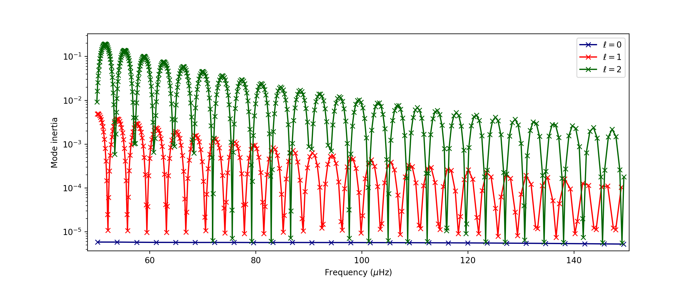
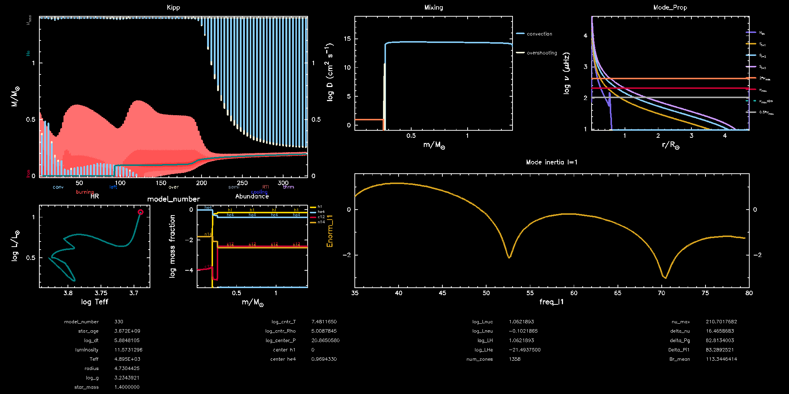
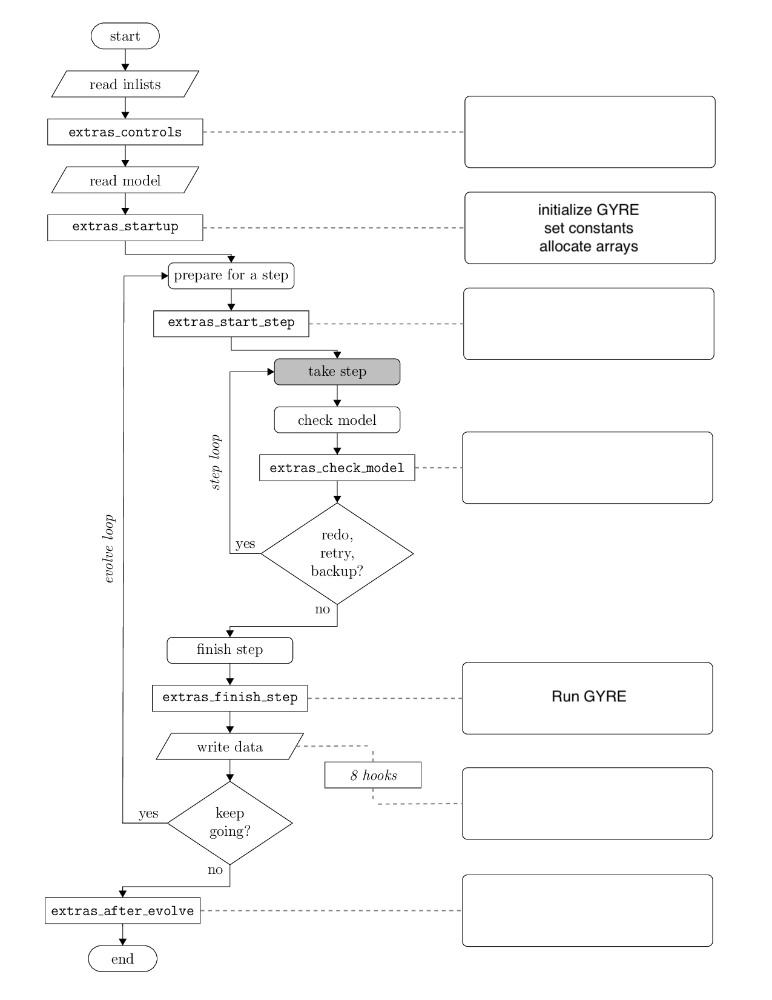

Minilab 1: Asteroseismology of mixed modes
===================================

Stars oscillate due to waves propagating in their interiors. The waves we are interested in, in the context of this project, i.e. the ones responsible for solar-like oscillations (see e.g. García & Ballot 2019), are excited by turbulent convection. As they propagate, these waves interfere and form normal modes of oscillations, i.e. standing waves, the frequencies of which depend on the internal structure of the star. For this reason, they are called *eigenmodes* of the star, the associated frequencies are the *eigenfrequencies*, and we can also calculate the *eigenfunctions*, i.e. perturbations to the structure of the star. These are obtained by solving the equations of stellar oscillations (see e.g. `Unno et al (1989) <https://ui.adsabs.harvard.edu/abs/1989nos..book.....U/abstract>`__ or `Aerts et al. (2010) <https://ui.adsabs.harvard.edu/abs/2010aste.book.....A/abstract>`__). Depending on the frequency of the wave, we distinguish two kind of waves: buoyancy waves (low frequency) and acoustic waves (high frequency). Modes with the buoyancy force as the restoring force are gravity (g) modes (these are the ones studied during Tuesday's labs) and the ones with the pressure force as the restoring force are pressure (p) modes. Each mode is identified with a combination of three integers: the angular, or spherical harmonic, degree :math:`\ell`, the azimuthal order :math:`m` and the radial order :math:`n`.

This first minilab focuses on the coupling between p and g modes, i.e. mixed modes, in a red giant stellar model. These modes are very important because due to this coupling they probe the entire interior of stars. To illustrate this coupling, a useful diagnostic is to look at the normalised mode inertia E, which is defined as (see e.g. Eq. 43 of Hekker & Christensen-Dalsgaard 2017)

.. math::

    \mathrm{E} = \frac{\int_0^{M_{\rm star}} \left[|\xi_r(r)|^2 + \ell \left(\ell + 1 \right) |\xi_{\rm h}(r)|^2 \right] \mathrm{d} M}{M_{\rm star} \left[|\xi_r(R_{\rm star})|^2
    + \ell \left(\ell + 1 \right) |\xi_{\rm h}(R_{\rm star})|^2 \right]}~~~~~~~~~~~~(1)

with :math:`M_{\rm star}` the mass of the star, :math:`R_{\rm star}` the photospheric radius of the star, :math:`\xi_r` and :math:`\xi_{\rm h}` the radial and horizontal displacements associated with the mode, :math:`\ell` the angular degree from the spherical harmonics and :math:`\mathrm{d}M = 4\pi \rho r^2 \mathrm{d}r` the mass enclosed in the sphere between :math:`r` and :math:`r + \mathrm{d}r`. For mixed modes, the mode inertia presents a typical oscillating pattern as illustrated in the figure below, which presents the inertia :math:`E` of mixed modes as a function of frequency.

Each cross corresponds to an eigenmode computed using GYRE. The modes with low inertia are mostly confined in the envelope and thus dominated by the p mode component, whereas the modes with high inertia are dominated by the g mode part. The high density of the modes in the crest of the oscillations are a consequence of the asymptotic period spacing of g modes :math:`\Delta \Pi` (already introduced on Tuesday).

The main goal of today's labs is to study the red giant (RG) star KIC11515377 observed by the *Kepler* satellite from NASA and reproduce the results from `Li et al. (2022, Nature) <https://ui.adsabs.harvard.edu/abs/2022Natur.610...43L/abstract>`__.
For this first minilab, the aim is to evolve a model of :math:`1.4\,M_{\odot}` star from a pre-computed ZAMS model up to the Red Giant Branch (RGB) and then to modify the ``run_star_extras`` file to run GYRE on the fly during a MESA run. Throughout these labs, tips are often provided just *below* the task.

Exercise 0: Setup
--------

First, download the Minilab 1 work directory `here
<https://github.com/mesa-summer-school-2023/mesa-school-bugnet/blob/main/work_directories/work_mini1.zip>`__. Click on the button "Download raw file" on the right next to the "Raw" and copy buttons. Once downloaded unpack the ``.zip`` file.

.. tip::

    If you want to unpack zip files from your terminal, use ``unzip file.zip``.

The ``inlist_project`` file from this working directory has already been edited to model the RG star KIC11515377. It is set to run from ZAMS and to stop when the effective temperature of the star is lower than :math:`10^{3.5}` K. This stopping condition is arbitrary, and we will stop before.
The composition of the star is set to the values given by Li et al. (2022, Nature). To do so, we set an initial composition that is uniform in the star by setting to true the following parameter in the ``&star_job`` section of the ``inlist_project``.

.. code-block:: console

    set_uniform_initial_composition = .true.

Then we specify the desired composition with

.. code-block:: console

    initial_h1  = 0.6669718492873334
    initial_h2  = 1.333943698574667e-05
    initial_he3 = 5.0123679469208106e-05
    initial_he4 = 0.3019498763205308

    initial_zfracs = 3

The last parameter ``initial_zfracs = 3`` sets the metals fractions abundances according to Grevesse & Sauval 1998 (GS98). We then set the corresponding opacities in the ``&kap`` section.

.. code-block:: console

    use_Zbase_for_Type1 = .false.
    kap_file_prefix = 'gs98'
    kap_lowT_prefix = 'lowT_fa05_gs98'
    kap_CO_prefix = 'gs98_co'
    Zbase = 0.031  ! reference metallicity necessary to calculate element variations

Because the final objective is to compare with observations, we have to also tune the atmopsheric boundary conditions in ``&controls`` by adding

.. code-block:: console

    atm_option = 'T_tau'
    atm_T_tau_relation = 'Eddington'
    atm_T_tau_opacity = 'varying'

This defines how the surface pressure and temperature are computed. We are using the Eddington grey relation, about which you can found more information `here <https://docs.mesastar.org/en/latest/atm/t-tau.html>`__.

When starting from with a repository created by someone else, it is good practice to make sure any compiled files are removed by executing the ``clean`` script

.. code-block:: console

    ./clean

This is in order to avoid conflict during the compilation of the code. Once this is done you can now compile the code, with

.. code-block:: console

    ./mk

This step should create the ``star`` executable file. You can run the model, i.e. make the star evolve, using the command

.. code-block:: console

    ./rn

A PGstar plot window displaying information about the structure and evolution of the star should appear. Some panels we will activate later on. You can stop the run using the command ``Ctrl+C``.
Any additional info on the inlist settings can be found in the `MESA docs <https://docs.mesastar.org/en/latest/>`__.

Exercise 1: Running GYRE on the fly
--------

As mentioned, we want to observe the variations of the mode inertia as a function of frequency, as the star evolves, in order to identify mixed modes. To do so, we want to run GYRE at each time step during the MESA run. This is done by editing the ``run_star_extras`` file.

.. tip::

    The figure at the bottom shows the flow of the ``run_star_extras.f90``, taken from the MESA docs.

Open the ``run_star_extras`` file that is located in the ``src/`` directory. To initialize GYRE, add the following lines in ``run_star_extras`` in the ``extras_startup`` subroutine.

.. code-block:: fortran

    ! Initialize GYRE

     call gyre_init('gyre_mix.in')

    ! Set constants

    call gyre_set_constant('G_GRAVITY', standard_cgrav)
    call gyre_set_constant('C_LIGHT', clight)
    call gyre_set_constant('A_RADIATION', crad)

    call gyre_set_constant('M_SUN', Msun)
    call gyre_set_constant('R_SUN', Rsun)
    call gyre_set_constant('L_SUN', Lsun)

    call gyre_set_constant('GYRE_DIR', TRIM(mesa_dir)//'/gyre/gyre')

The first function ``gyre_init`` initialises GYRE and calls the GYRE inlist file ``gyre_mix.in``. This file is used to set up the parameters required to run GYRE and is already present in the working directory.

Next, in order to run GYRE we have added a subroutine ``run_gyre`` at the end of the ``run_star_extras`` file.

.. code-block:: fortran

    subroutine run_gyre (id, ierr)

      integer, intent(in)  :: id
      integer, intent(out) :: ierr

      real(dp), allocatable :: global_data(:)
      real(dp), allocatable :: point_data(:,:)
      integer               :: ipar(0)
      real(dp)              :: rpar(0)

      ! Pass model data to GYRE

      call star_get_pulse_data(id, 'GYRE', .FALSE., .TRUE., .TRUE., &
          global_data, point_data, ierr)
      if (ierr /= 0) then
          print *,'Failed when calling star_get_pulse_data'
          return
      end if

      call gyre_set_model(global_data, point_data, 101)

      ! Run GYRE to get modes

      call gyre_get_modes(1, process_mode, ipar, rpar)

      gyre_has_run = .true.

      contains

      subroutine process_mode (md, ipar, rpar, retcode)

          type(mode_t), intent(in) :: md
          integer, intent(inout)   :: ipar(:)
          real(dp), intent(inout)  :: rpar(:)
          integer, intent(out)     :: retcode
          integer :: k

          type (star_info), pointer :: s
          ierr = 0
          call star_ptr(id, s, ierr)
          if (ierr /= 0) return

          ! Print out degree, radial order, mode inertia, and frequency
          print *, 'Found mode: index, l, m, n_p, n_g, E_norm, nu = ', &
              md%id-nmax_prev, md%l, md%m, md%n_p, md%n_g, md%n_pg,
              REAL(md%E_norm()),REAL(md%freq('UHZ'))

          frequencies(md%l+1, md%id-nmax_prev) = REAL(md%freq('UHZ'))
          inertias(md%l+1, md%id-nmax_prev) = REAL(md%E_norm())
          nmax = md%id
          retcode = 0
    end subroutine process_mode

    end subroutine run_gyre

This subroutine runs GYRE on a given MESA model identified with the variable ``id``. First, the function ``star_get_pulse_data`` extracts from the MESA model the data required for pulsation analysis. These data are separated in two arrays: ``global_data`` and ``point_data``. Next, the function ``gyre_set_model`` sends these data to GYRE. Then, with the function ``gyre_get_modes``, GYRE actually computes the eigenmodes of the stellar model for angular degree :math:`\ell = 1`. In this function the first integer indicates the angular degree to compute, it can be modified to get other modes. This function takes as an argument ``process_mode``, which is the last subroutine we have defined. It means that when executing the function ``gyre_get_modes``, MESA calls and executes ``process_mode``. Thanks to this function, we can decide what GYRE outputs are. Here, we are interested in the frequencies and the inertia of the modes, and we store them in the global arrays ``frequencies(:,:)`` and ``inertias(:,:)``.

Now that we have set up GYRE, it is ready to run during a MESA run, the last thing to do is to set:

.. code-block:: console

    x_logical_ctrl(1) = .true.

in the ``inlist_project`` file.
Then, recompile MESA with ``./mk`` to include changes made in ``run_star_extras`` and start running the model with the usual command ``./rn``. When the model is sufficiently evolved and mixed modes are excited in the star, GYRE will start to compute the eigenmodes of the model (this can take a few minutes). Here we have set GYRE to start running when :math:`\log T_{\rm eff} < 3.7`. At some point during the run, the terminal should print something like

.. code-block:: console

    Found mode: index, l, m, n_p, n_g, E_norm, nu = 130 1 0 3 82 -79 2.285E-02 125.57

The last variable ``nu`` is the frequency of the corresponding mode. Once GYRE has computed several modes, you can stop the run using ``Ctrl+C``. GYRE should be called every 2 steps.

You can edit the ``gyre_mix.in`` to change the range (and units of the range) of frequencies of the modes computed by GYRE. To do so change the parameters in ``&scan``

.. code-block:: console

    freq_min = 50
    freq_max = 150
    freq_units = 'UHZ'

.. tip::

    If you plan to use GYRE for your science, it is good to know that there is a `support forum <http://user.astro.wisc.edu/~townsend/gyre-forums/>`__ where you can find answers to errors or post a question yourself.

.. warning::

    In the call to

    .. code-block:: fortran

       call star_get_pulse_data(id, 'GYRE', .FALSE., .TRUE., .TRUE., global_data, point_data, ierr)

    the booleans stand for ``add_center_point``, ``keep_surface_point``, ``add_atmosphere``, in that order. If you change the values of these controls in the GYRE inlist, it will not have any effect.

Exercise 2: Mode inertia
--------

The last step for this minilab is to plot the mode inertia Eq. (1) to see what it looks like. This equation is already implemented in GYRE, so it can be computed directly using the parameter ``E_norm``. For that, we need to edit the ``inlist_pgstar`` file. This file controls what is plotted in the pgstar window during a MESA run. Take some time to have a look at it. You can notice that there are parameters to control what is plotted but also the size and location of the plots. In order to get the mode inertia plotted, the next lines of code should be added at the end of the file

.. code-block:: console

  ! Add mode inertia panel

  Grid1_plot_name(6) = 'Profile_Panels1'
  Grid1_plot_row(6) = 5
  Grid1_plot_rowspan(6) = 4
  Grid1_plot_col(6) = 5
  Grid1_plot_colspan(6) = 6

  Profile_Panels1_num_panels = 1
  Profile_Panels1_title = 'Mode inertia l=1'
  Profile_Panels1_xaxis_name = 'freq_l1'
  Profile_Panels1_yaxis_name = 'Enorm_l1'
  Profile_Panels1_other_yaxis_name(1) = ''
  Profile_Panels1_xmin = 50
  Profile_Panels1_xmax = 150

  Grid1_plot_pad_left(6) = 0.05
  Grid1_plot_pad_right(6) = 0.05
  Grid1_plot_pad_top(6) = 0.04
  Grid1_plot_pad_bot(6) = 0.07
  Grid1_txt_scale_factor(6) = 0.5

The two parameters ``Profile_Panels1_xaxis_name`` and ``Profile_Panels1_xaxis_name`` define what variable are assigned to the x and y axis respectively. You can modify the displayed range of frequency by editing the ``Profile_Panels1_xmin`` and ``Profile_Panels1_xmax`` parameters.
Now, you can start a new run with ``./rn``. A new plot should have appeared on your pgstar window. Initially, this new plot will remain blank. After some time, verify that you get the oscillations pattern presented in the figure above for the dipolar mode :math:`\ell = 1`.

In your pgstar window should look like the figure below. Most panels you should have already seen earlier this week. The panel in the top left shows a Kippenhahn diagram where you can see the nuclear burning regions (in red) and the convective regions (in blue) evolve over time. The bottom right panel shows the mode inertia for the modes of angular degree :math:`\ell = 1`. This oscillating pattern tells us that there is a coupling between the p modes and the g modes and that GYRE predicts that the modes it computes are indeed mixed modes. What happens to this pattern as the star evolves? Why is that? 

.. admonition:: Bonus exercise

    Try to plot the mode inertias for the modes of spherical degree :math:`\ell = 0` or 2. To do so, you will need to edit the following files: ``gyre_mix.in``,
    ``run_star_extras`` and ``inlist_pgstar``.

